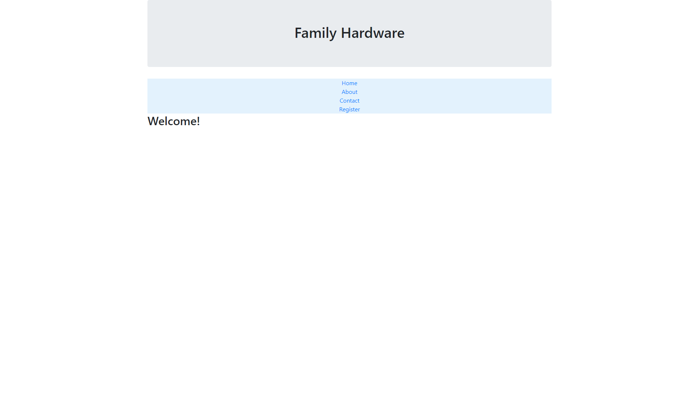

# Family Hardware

This repository contains files used to create an online hardware store for my Web Application Development course

## Homepage




## Master Page

This site uses a master page

### Site.Master

```html
<%@ Master Language="C#" AutoEventWireup="true" CodeBehind="Site.master.cs" Inherits="Project2.Site" %>

<!DOCTYPE html>

<html>
<head runat="server">
    <title>Family Hardware</title>
    <link href="Content/bootstrap.css" rel="stylesheet" />
    <script src="Scripts/jquery-3.0.0.js"></script>
    <script src="Scripts/bootstrap.js"></script>
    <asp:ContentPlaceHolder ID="head" runat="server"/>
</head>
<body>

        <div class="container">
            <div class="jumbotron text-center">
                <h1>Family Hardware</h1>
            </div>
            <nav class="nav navbar-light" style="background-color:#e3f2fd;">
                <div class="container-fluid text-center">
                    <%-- 
                    <div class="navbar-header">
                        <a class="navbar-brand" href="#"></a>
                    </div>
                    --%>
                    <ul class="nav navbar-nav">
                        <li><a href="Default.aspx">Home</a></li>
                        <li><a href="About.aspx">About</a></li>
                        <li><a href="Contact.aspx">Contact</a></li>
                        <li><a href="CustomerRegistration.aspx">Register</a></li>
                    </ul>
                </div>
            </nav>
                
            <asp:ContentPlaceHolder ID="body" runat="server" />
        </div>
</body>
</html>
```

### Default.aspx

```aspx
<%@ Page Title="" Language="C#" MasterPageFile="~/Site.Master" AutoEventWireup="true" CodeBehind="Default.aspx.cs" Inherits="Project2.Default" %>
<asp:Content ID="Content1" ContentPlaceHolderID="head" runat="server">
</asp:Content>
<asp:Content ID="Content2" ContentPlaceHolderID="body" runat="server">
    <h2>Welcome!</h2>
</asp:Content>
```

### About.aspx

```aspx
<%@ Page Title="" Language="C#" MasterPageFile="~/Site.Master" AutoEventWireup="true" CodeBehind="About.aspx.cs" Inherits="Project2.About" %>
<asp:Content ID="Content1" ContentPlaceHolderID="head" runat="server">
</asp:Content>
<asp:Content ID="Content2" ContentPlaceHolderID="body" runat="server">
    <h2>About</h2>
    Family Hardware online is a convenient location for you to browse our merchandise.
</asp:Content>
```

### Contact

```aspx
<%@ Page Title="" Language="C#" MasterPageFile="~/Site.Master" AutoEventWireup="true" CodeBehind="Contact.aspx.cs" Inherits="Project2.Contact" %>
<asp:Content ID="Content1" ContentPlaceHolderID="head" runat="server">
</asp:Content>
<asp:Content ID="Content2" ContentPlaceHolderID="body" runat="server">
    <h2>Contact</h2>
    24 Stuart Ave, Garden City, New York 11530
    <br>
    Phone. 555-555-5555
    <br>
    <a href="mailto:<% =ConfigurationManager.AppSettings["SiteManager"] %>"><% =ConfigurationManager.AppSettings["SiteManager"] %></a>
</asp:Content>
```

### Web.Config

```html
<?xml version="1.0"?>
<!--
  For more information on how to configure your ASP.NET application, please visit
  https://go.microsoft.com/fwlink/?LinkId=169433
  -->
<configuration>
  <!--
    For a description of web.config changes see http://go.microsoft.com/fwlink/?LinkId=235367.

    The following attributes can be set on the <httpRuntime> tag.
      <system.Web>
        <httpRuntime targetFramework="4.8" />
      </system.Web>
  -->
  <system.web>
    <compilation debug="true" targetFramework="4.8"/>
    <httpRuntime targetFramework="4.6.1"/>
  </system.web>
  <appSettings>
    <add key="SiteManager" value="support@familyHardware.com"/>
    <add key="ValidationSettings:UnobtrusiveValidationMode" value="None"/>
  </appSettings>
  <connectionStrings>
    <add name="MyData" connectionString="Data Source=10.22.12.71; Initial Catalog=HardwareStore; User ID=Student1; Password=CSC283;" providerName="System.Data.SqlClient"/>
  </connectionStrings>
  <system.codedom>
    <compilers>
      <compiler language="c#;cs;csharp" extension=".cs" type="Microsoft.CodeDom.Providers.DotNetCompilerPlatform.CSharpCodeProvider, Microsoft.CodeDom.Providers.DotNetCompilerPlatform, Version=2.0.0.0, Culture=neutral, PublicKeyToken=31bf3856ad364e35" warningLevel="4" compilerOptions="/langversion:default /nowarn:1659;1699;1701"/>
      <compiler language="vb;vbs;visualbasic;vbscript" extension=".vb" type="Microsoft.CodeDom.Providers.DotNetCompilerPlatform.VBCodeProvider, Microsoft.CodeDom.Providers.DotNetCompilerPlatform, Version=2.0.0.0, Culture=neutral, PublicKeyToken=31bf3856ad364e35" warningLevel="4" compilerOptions="/langversion:default /nowarn:41008 /define:_MYTYPE=\&quot;Web\&quot; /optionInfer+"/>
    </compilers>
  </system.codedom>
</configuration>
```
